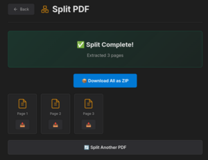
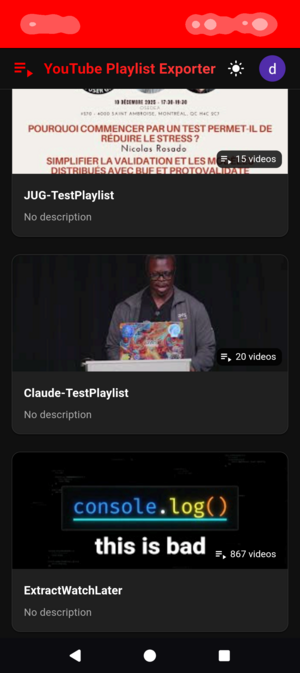
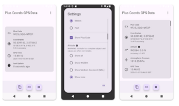

# Prompt to Product

From prompt to product — AI-assisted software development in practice.

---

## Featured Projects

### [PDF Tools](pages/projects/PDF-TOOLS.md)

Browser-based PDF manipulation: compress, merge, split, extract pages, convert to grayscale, and change formats. Powered by Ghostscript compiled to WebAssembly — files are processed entirely in your browser and never uploaded to a server. Installable as a PWA.

**Live:** [pdf.pwasuite.com](https://pdf.pwasuite.com) | **Repo:** [pwasuite/pdftools](https://github.com/pwasuite/pdftools)

---

### [Playlist Exporter for YouTube](pages/projects/PLAYLIST-EXPORTER.md)

Export YouTube playlist data to CSV or JSON. Built with Claude Code.

**NEW:** [playlistexporter.pwasuite.com](https://playlistexporter.pwasuite.com/) | **Repo:** [pwasuite/playlistexporter](https://github.com/pwasuite/playlistexporter)

---

### [Plus Coords GPS](pages/projects/PLUS-COORDS-GPS.md)

Native Android app displaying GPS coordinates, altitude, speed, and Plus Codes. Works fully offline and can generate shareable location links without an internet connection.

**Available on:** [Google Play Store](https://play.google.com/store/apps/details?id=com.daviddallet.offlinegps)

---

## More Projects

- [**F1 Dashboard**](pages/projects/F1-DASHBOARD.md) — Formula 1 results dashboard with national anthems. [fvibe1.netlify.app](https://fvibe1.netlify.app)

- [**Identity Detective**](pages/projects/IDENTITY-DETECTIVE.md) — Detective-themed name profiler using public APIs (Agify, Genderize, Nationalize, REST Countries). [namedetective.surge.sh](https://namedetective.surge.sh)

- [**GitHub Profile Card**](pages/projects/GITHUB-PROFILE-CARD.md) — Profile card generator fetching GitHub user data. [ghprofilecard.netlify.app](https://ghprofilecard.netlify.app)

- [**Wikipedia Pulse Trade**](pages/projects/WIKIPEDIA-PULSE-TRADE.md) — Real-time Wikipedia edit trading game (desktop only). [wikipulsetrade.netlify.app](https://wikipulsetrade.netlify.app)

- [**Antigravity Tools**](pages/projects/ANTIGRAVITY-TOOLS.md) — Linux CLI tools for Google Antigravity and model quota checking. [daviddallet/antigravity-tools-linux](https://github.com/daviddallet/antigravity-tools-linux)

- [**HydroPeak Calendar**](pages/projects/HYDROPEAK.md) — Hydro-Québec peak events as a subscribable calendar for residential customers.

---

[View Full Gallery](pages/GALLERY.md)
