# Screenshot Gallery

A visual tour of AI-assisted projects.

---

## PDF Tools

Split, merge, and manage PDFs directly in your browser.

[View Project](projects/PDF-TOOLS.md)

[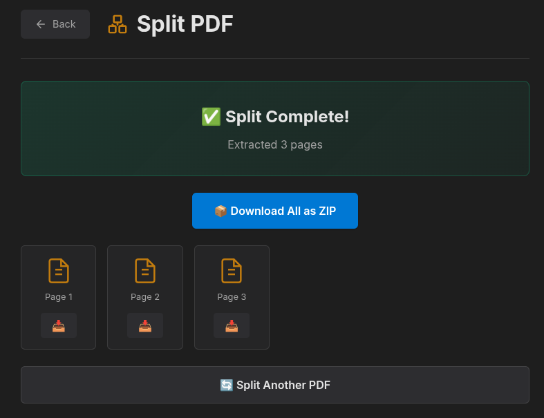](projects/PDF-TOOLS.md)

[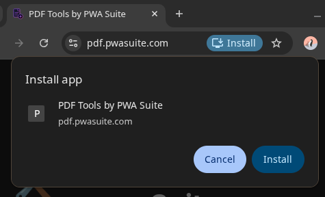](projects/PDF-TOOLS.md)

[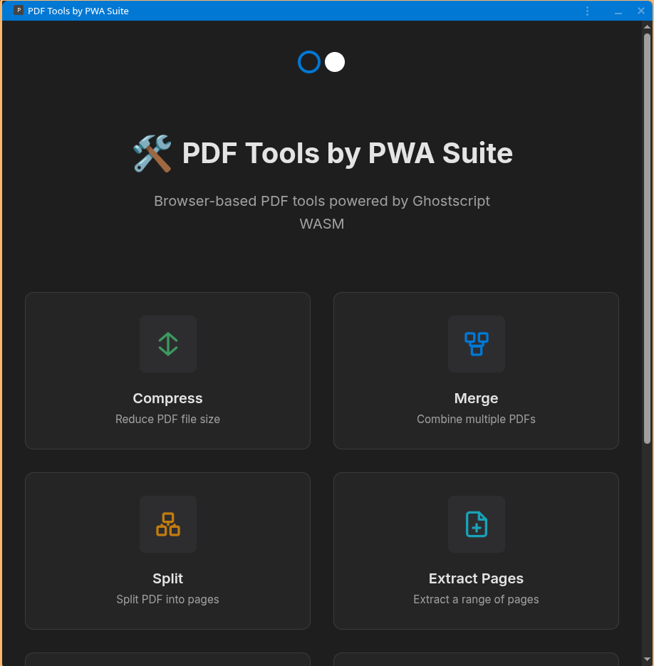](projects/PDF-TOOLS.md)

---

## Playlist Exporter for YouTube

Export YouTube playlists to multiple formats with a single click.

[View Project](projects/PLAYLIST-EXPORTER.md)

[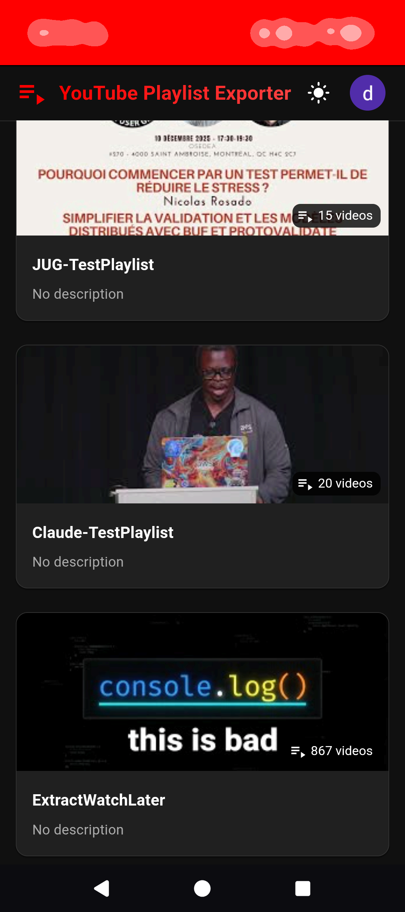](projects/PLAYLIST-EXPORTER.md)

[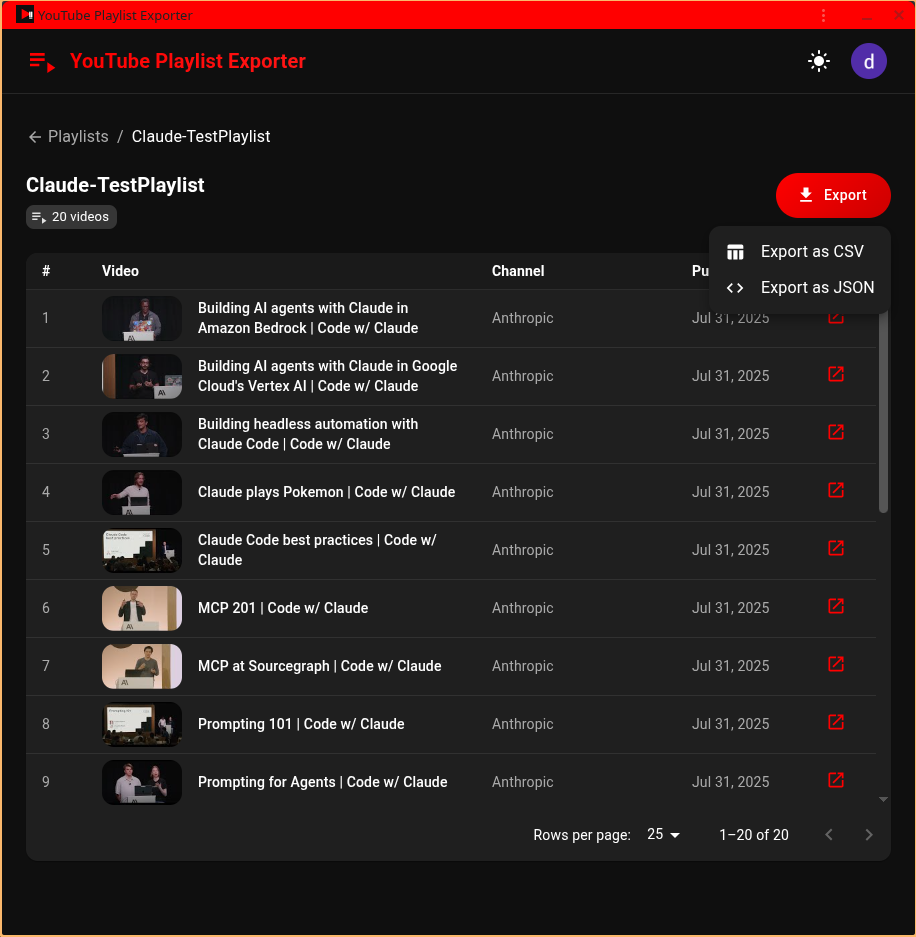](projects/PLAYLIST-EXPORTER.md)

[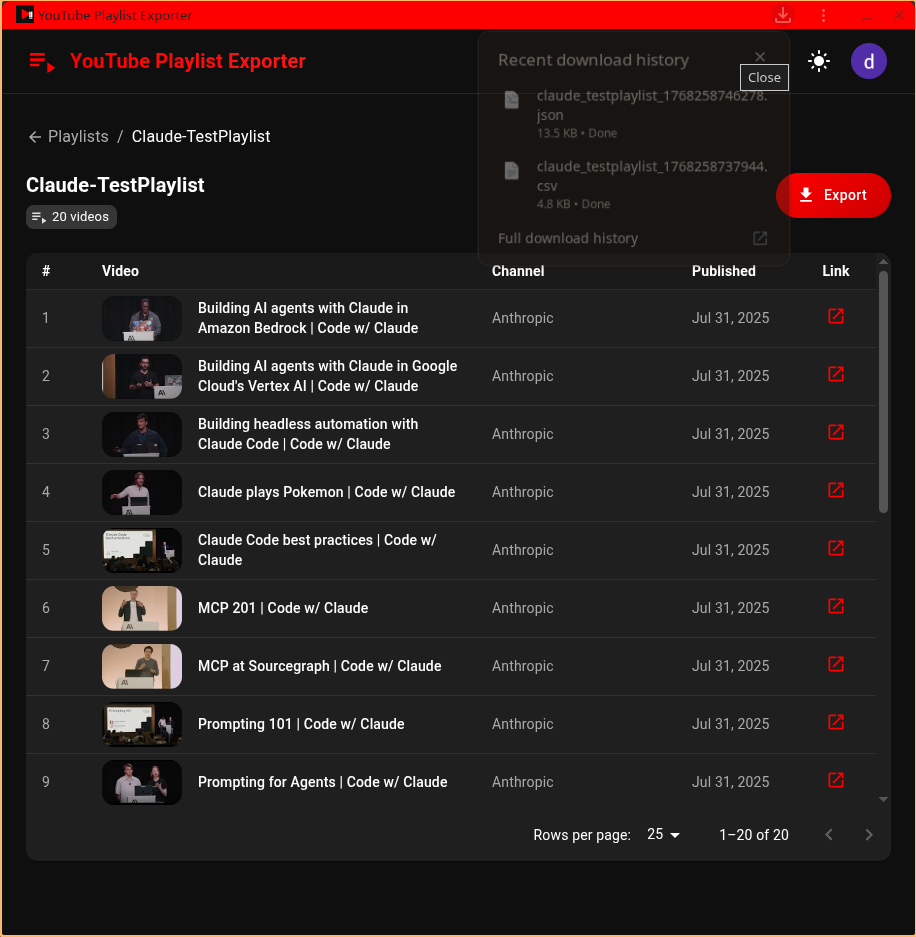](projects/PLAYLIST-EXPORTER.md)

---

## Plus Coords GPS

Convert between Plus Codes and GPS coordinates on Android.

[View Project](projects/PLUS-COORDS-GPS.md)

[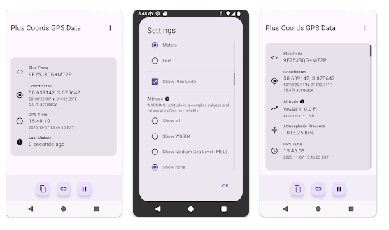](projects/PLUS-COORDS-GPS.md)

---

## F1 Dashboard

Real-time Formula 1 statistics and race data visualization.

[View Project](projects/F1-DASHBOARD.md)

[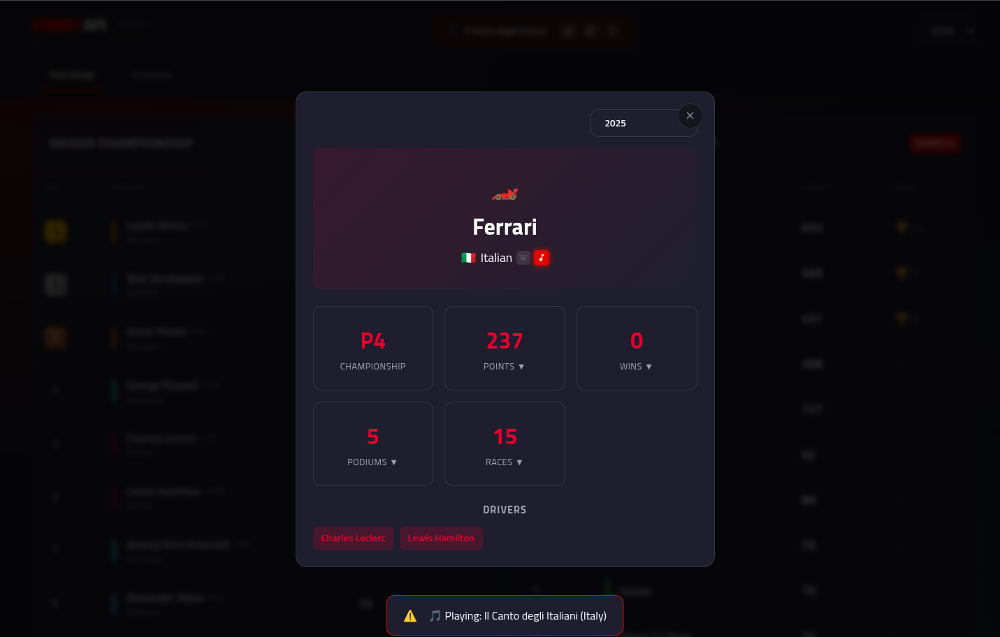](projects/F1-DASHBOARD.md)

[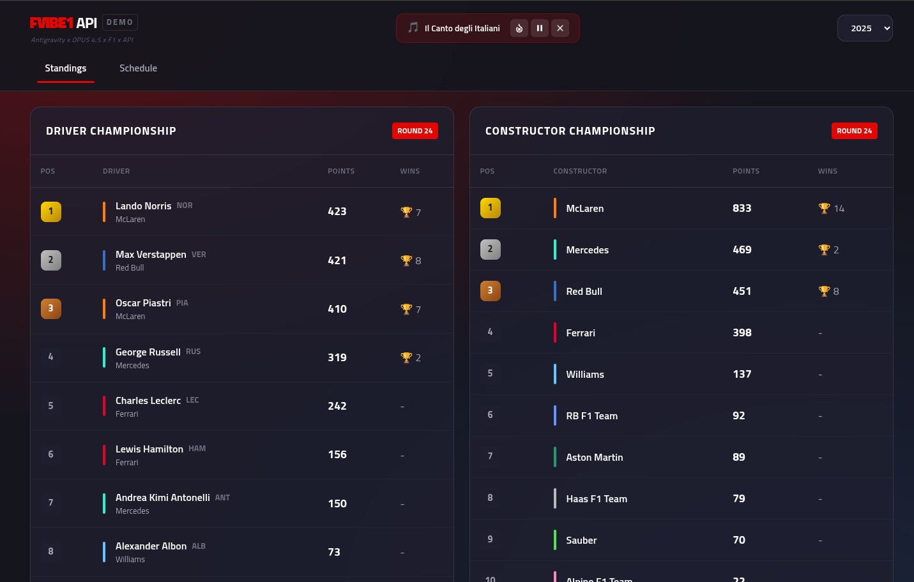](projects/F1-DASHBOARD.md)

[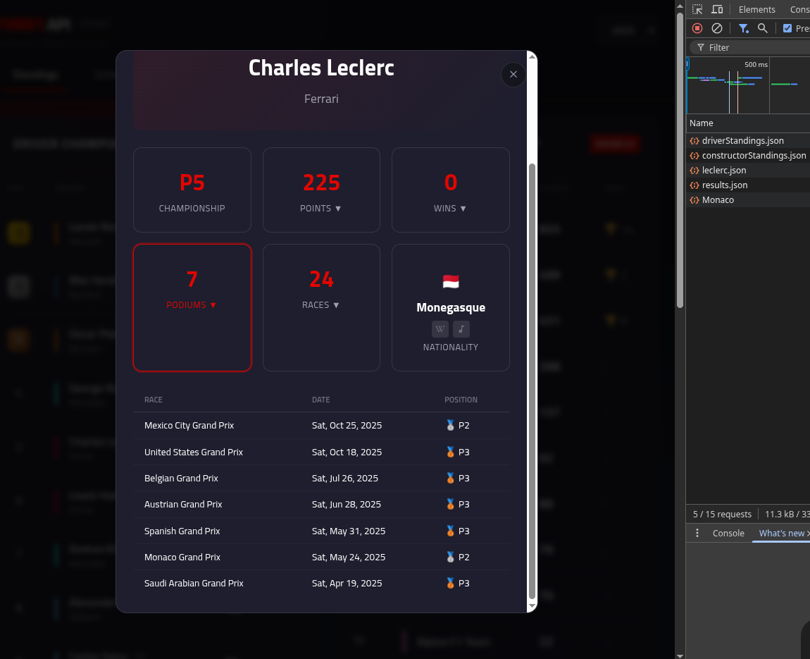](projects/F1-DASHBOARD.md)

[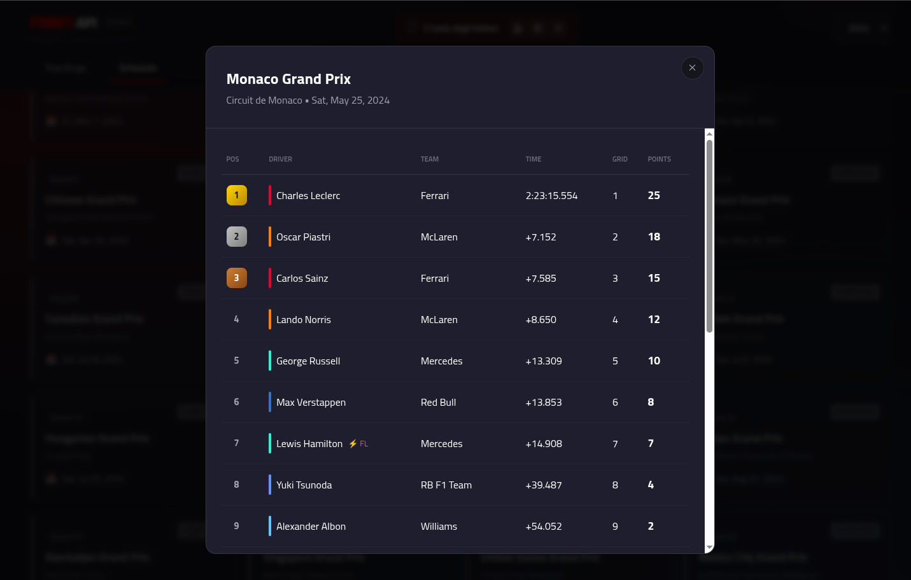](projects/F1-DASHBOARD.md)

---

## Antigravity Tools

Internal tooling for quota management and system monitoring.

[View Project](projects/ANTIGRAVITY-TOOLS.md)

[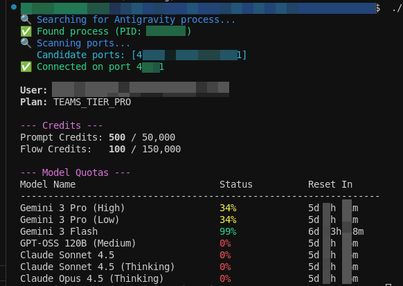](projects/ANTIGRAVITY-TOOLS.md)

---

## HydroPeak Calendar

Hydro-Québec peak events as a subscribable calendar.

[View Project](projects/HYDROPEAK.md)

[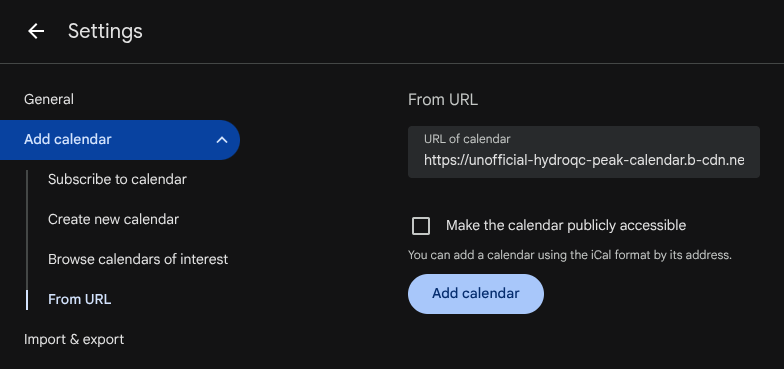](projects/HYDROPEAK.md)

[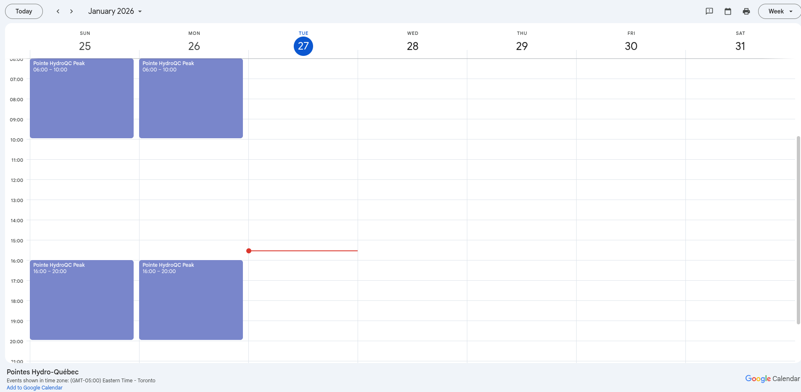](projects/HYDROPEAK.md)

---

## Pointes HQ Peaks

Hydro-Québec peak events in a dark-themed installable PWA.

[View Project](projects/POINTES-HQ-PEAKS.md)

[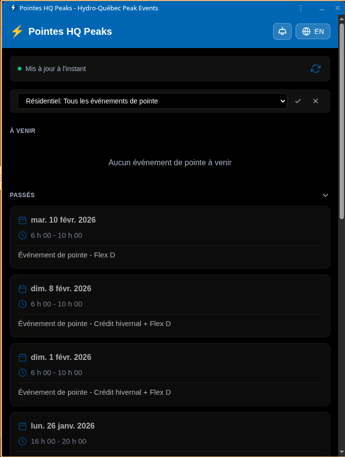](projects/POINTES-HQ-PEAKS.md)

---

[Back to Main README](../README.md)
